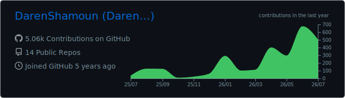
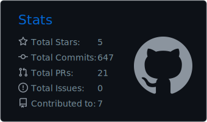
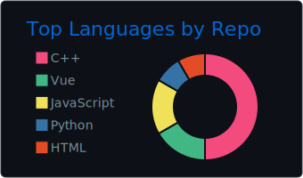
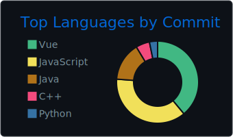
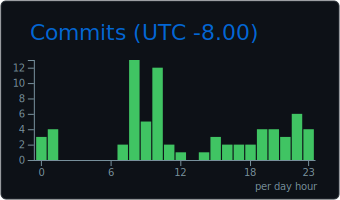

<!--
  Profile README for github.com/DarenShamoun
  Place this file at: DarenShamoun/DarenShamoun  ->  README.md
  Tip: GitHub stat cards render automatically once this is on the default branch.
-->

---

## 👋 About Me

I'm a **software engineer** who builds production systems end-to-end — across **full-stack web, mobile, and embedded** targets — and treats **agentic AI workflows as core engineering infrastructure** rather than a novelty.

- 🩺 Currently a **Software Engineer Intern at BD (Becton Dickinson)**, leading **BD-Pixie** — a wireless companion platform for the BD Alaris infusion pump, running on the device's **embedded Linux** board with a paired **React Native** app.
- 🎓 Graduating **May 2026, Magna Cum Laude with Departmental Honors** from the **University of San Diego** (B.S. Computer Science, focus in **AI & Data Science**, GPA 3.83).
- 🏗️ Comfortable from the **GATT/BLE protocol on bare embedded Linux** all the way up to a **Next.js + PostgreSQL** product UI.
- 🤖 I orchestrate **specialized parallel AI agents** (Planner, Reviewer, Build-Error-Resolver, Security) behind real audit gates — production quality, not vibes.
- 📍 Based in **San Diego, CA** · 🏅 **HKN** & **IEEE** Lifetime Member · **ACM** Member · former **NASA NCAS Aerospace Scholar**.

---

## 🛠️ Tech Stack

**Languages**

**Frameworks & Frontend**

**Infrastructure & Embedded**

**AI Development**

---

## 🚀 Featured Work

### 🩺 BD-Pixie — Wireless Companion for the BD Alaris Infusion Pump
> _Software Engineer Intern @ BD · USD Senior Design × BD_

A wireless platform that lets biomedical techs triage and provision infusion pumps **at the bedside**, eliminating the cart-laptop-cable workflow. As the BLE, mobile, and embedded lead I authored the **majority of the implementation** (~80% of the total build across both ends of the system).
- **Mobile (React Native):** secure QR-code pairing, real-time pump status, chunked-BLE diagnostic log retrieval with end-to-end CRC integrity (**~25–50× faster** than serial reads), and **batch provisioning of 10+ pumps** from one handheld session.
- **Embedded (Python on embedded Linux):** custom GATT protocol, device-side state management, and PCU API integration — refactored to **SOLID** for clean handoff to BD's firmware team.
- **Projected impact:** ~90 min saved per pump per service cycle · ~750 hours back per 500-pump fleet · 50% fewer pumps pulled for diagnostics.

### 🏠 Red Carpet Real Estate — Property Management Platform
> _Full-Stack Developer · Sep 2022 – Present_

Solo-built the **end-to-end digital transformation** of a multi-property real estate business, replacing paper operations. **Next.js + React · Flask · PostgreSQL · Tailwind**, with modular data models for properties, units, tenants, leases, and financials plus secure document handling.

### ⚙️ Pipelined RISC-V Processor — Digital Systems
> _[Digital-Hardware-Projects](https://github.com/DarenShamoun/Digital-Hardware-Projects) · SystemVerilog_

A **5-stage pipelined RISC-V CPU** built from logic gates up — full adder → Karnaugh-mapped decoders → ALU → single-cycle core → the pipelined design — with a complete **hazard unit** (data forwarding, load-use stalls, control-hazard flushing). Verified in **ModelSim**, synthesized for **FPGA** in Quartus.

### 🌐 Computer Networks in C/C++
> _[Networking-Projects](https://github.com/DarenShamoun/Networking-Projects) · C · C++_

Low-level systems networking: a **multithreaded HTTP server** (thread pool + bounded buffer), a **stop-and-wait reliable-transport protocol** over an unreliable socket (handshake, sequencing, retransmission), an iterative **DNS resolver**, and reverse-engineering an undocumented protocol from packet captures.

### 💻 Dashbyte — IT Services Company (Co-Founder & Head of IT)
> _Jul 2020 – Jan 2024_

Co-founded an IT company **as a teenager** — delivered **10+ client websites**, built and deployed **~50 systems** (PCs, servers, mining rigs), and ran ongoing IT and network support.

> 🔭 More projects — **real-time computer vision** (MediaPipe + IoT), **ML pipelines**, a **Chrome extension**, and an in-browser **n-body simulator** — on my **[portfolio »](https://darenshamoun.github.io)**.

---

## 📊 GitHub Stats

<!-- These cards are generated as static SVGs by the weekly
     "GitHub Profile Summary Cards" Action (.github/workflows/profile-summary-cards.yml),
     so they always render — no dependency on a third-party live service. -->

---

### 💬 Let's build something

Open to collaboration on **machine learning, agentic AI, and full-stack** initiatives.

