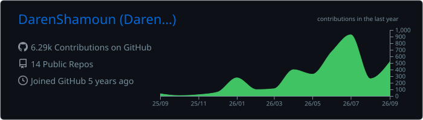
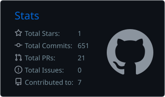
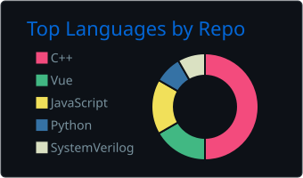
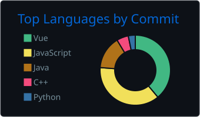
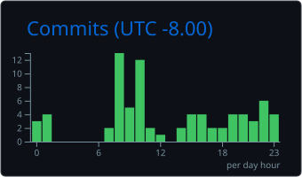

<!--
  Profile README for github.com/DarenShamoun
  Place this file at: DarenShamoun/DarenShamoun  ->  README.md
  Tip: GitHub stat cards render automatically once this is on the default branch.
-->

---

## About me

I'm a software engineer who likes building things end to end, whether that ends up being a full-stack web app, a mobile app, or code running on an embedded Linux board. Right now I'm a Software Engineer Intern at BD (Becton Dickinson), where I lead BD-Pixie, a wireless companion platform for the BD Alaris infusion pump that pairs a React Native app with a service running on the pump's embedded Linux board. That range is something I really enjoy, as I'm comfortable anywhere from a custom GATT/BLE protocol on bare embedded Linux all the way up to a Next.js and PostgreSQL product UI.

I graduated from the University of San Diego in May 2026, magna cum laude with departmental honors, with a B.S. in Computer Science focused in AI & Data Science and a 3.83 GPA. I also treat agentic AI workflows as core engineering infrastructure rather than a novelty, I orchestrate specialized parallel agents (planner, reviewer, build-error-resolver, security) behind real audit gates so that what comes out is actually production quality.

I'm based in San Diego, CA. I'm a lifetime member of HKN and IEEE, an ACM member, and a former NASA NCAS Aerospace Scholar.

---

## Tech stack

**Languages**

**Frameworks & Frontend**

**Infrastructure & Embedded**

**AI Development**

---

## Featured work

### BD-Pixie, a wireless companion for the BD Alaris infusion pump

> _Software Engineer Intern @ BD · USD Senior Design × BD_

BD-Pixie lets biomedical techs triage and provision infusion pumps right at the bedside instead of dragging around the usual cart, laptop, and cable setup. I was the BLE, mobile, and embedded lead on the project and wrote the majority of the implementation, roughly 80% of the total build across both ends of the system. On the mobile side (React Native) that meant secure QR-code pairing, real-time pump status, chunked-BLE diagnostic log retrieval with end-to-end CRC integrity that came out around 25-50x faster than serial reads, and batch provisioning of 10+ pumps from a single handheld session. On the embedded side (Python on embedded Linux) I built the custom GATT protocol, the device-side state management, and the PCU API integration, then refactored it all to SOLID principles so it could be handed off cleanly to BD's firmware team. The projected impact works out to about 90 minutes saved per pump per service cycle, roughly 750 hours back per 500-pump fleet, and 50% fewer pumps pulled for diagnostics.

### Red Carpet Real Estate, a property management platform

> _Full-Stack Developer · Sep 2022 - Present_

This one is the end-to-end digital transformation of a multi-property real estate business, which I built solo to replace what used to be an entirely paper operation. It runs on Next.js and React with a Flask backend and PostgreSQL, styled with Tailwind, and has modular data models for properties, units, tenants, leases, and financials along with secure document handling.

### Pipelined RISC-V processor

> _[Digital-Hardware-Projects](https://github.com/DarenShamoun/Digital-Hardware-Projects) · SystemVerilog_

A 5-stage pipelined RISC-V CPU built from logic gates up, starting with a full adder, then Karnaugh-mapped decoders, an ALU, a single-cycle core, and finally the pipelined design with a complete hazard unit handling data forwarding, load-use stalls, and control-hazard flushing. Everything was verified in ModelSim and synthesized for FPGA in Quartus.

### Computer networks in C/C++

> _[Networking-Projects](https://github.com/DarenShamoun/Networking-Projects) · C · C++_

Low-level systems networking work, including a multithreaded HTTP server built on a thread pool and bounded buffer, a stop-and-wait reliable-transport protocol over an unreliable socket with handshaking, sequencing, and retransmission, an iterative DNS resolver, and a project where I reverse-engineered an undocumented protocol from packet captures.

### Dashbyte, an IT services company

> _Co-Founder & Head of IT · Jul 2020 - Jan 2024_

I co-founded an IT company as a teenager, we delivered 10+ client websites, built and deployed around 50 systems (PCs, servers, and mining rigs), and handled ongoing IT and network support for our clients.

More of my projects, including real-time computer vision with MediaPipe and IoT, ML pipelines, a Chrome extension, and an in-browser n-body simulator, are on my [portfolio](https://darenshamoun.github.io).

---

## GitHub stats

<!-- These cards are generated as static SVGs by the weekly
     "GitHub Profile Summary Cards" Action (.github/workflows/profile-summary-cards.yml),
     so they always render without depending on a third-party live service. -->

---

### Let's build something

I'm always open to collaborating on machine learning, agentic AI, and full-stack projects, so feel free to reach out.

